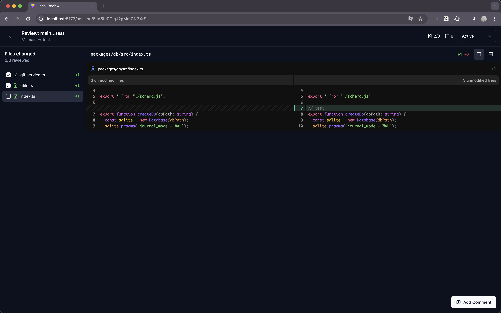

# local-review



Local code review system - Git diff based AI + Human collaborative code review

## Key Features

- Base Branch Selection – Choose a base branch when creating a review session
- Diff Viewer – Display code diffs using @pierre/diffs (split / unified layouts)
- Line-by-Line Comments – Add comments to specific lines, reply to comments, and mark them as resolved
- File Review Status – Checkbox to mark each file as reviewed
- Session Management – Create, list, and update the status of review sessions
- SQLite Persistence – All data is stored in .local-review.db
- **MCP Server** – 21 tools for AI to manage sessions, comments, and files

## Claude Code Plugin Installation

```bash
/plugin marketplace add tolluset/local-review

/plugin install local-review
```

### MCP Tools

| Category | Tool | Description |
|----------|------|-------------|
| **Git** | `git:list-branches` | List branches |
| | `git:get-diff-files` | Get changed files |
| | `git:get-file-content-diff` | Get file content before/after |
| | `git:get-commits` | Get commit list |
| | `git:get-file-content` | Get file content at ref |
| | `git:get-raw-diff` | Get raw unified diff |
| | `git:get-working-changes` | Get staged/unstaged files |
| | `git:get-working-diff` | Get working directory diff |
| **Sessions** | `sessions:list` | List sessions with stats |
| | `sessions:create` | Create new session |
| | `sessions:get` | Get session details + files |
| | `sessions:update` | Update session |
| | `sessions:delete` | Delete session |
| **Comments** | `comments:list` | List comments |
| | `comments:create` | Create comment |
| | `comments:update` | Update comment |
| | `comments:delete` | Delete comment |
| | `comments:toggle-resolve` | Toggle resolve status |
| **Files** | `files:list` | List file review status |
| | `files:update-status` | Update file status |
| | `activities:list` | List activity logs |

### Usage with Claude

```
> Review the changes in my current branch

Claude uses MCP tools:
1. sessions:create - Create review session
2. git:get-diff-files - Get changed files
3. git:get-raw-diff - Analyze code changes
4. comments:create - Write review comments
```

### AI + Human Collaboration

1. **AI Review**: Claude analyzes code and writes comments via MCP tools
2. **Human Review**: Review AI comments and add more in web UI
3. **Collaboration**: Both work in the same session with real-time sync

## Manual Setup (Development)

### Project Structure

```
local-review/
├── apps/
│   ├── web/         # React + Vite + Tailwind + shadcn/ui
│   ├── server/      # Express API
│   └── mcp/         # MCP Server (21 tools)
├── packages/
│   ├── db/          # Drizzle ORM + SQLite
│   └── shared/      # Shared types
```

### Install dependencies

```bash
pnpm install
```

### Rebuild better-sqlite3 (Required for Node.js v24+)

```bash
pnpm add -g node-gyp
node-gyp rebuild -C node_modules/.pnpm/better-sqlite3@11.10.0/node_modules/better-sqlite3
```

### Run DB migrations

```bash
DATABASE_URL=./.local-review.db pnpm --filter @local-review/db migrate
```

### Start dev server

```bash
pnpm dev
```

Open http://localhost:6777 in your browser.
